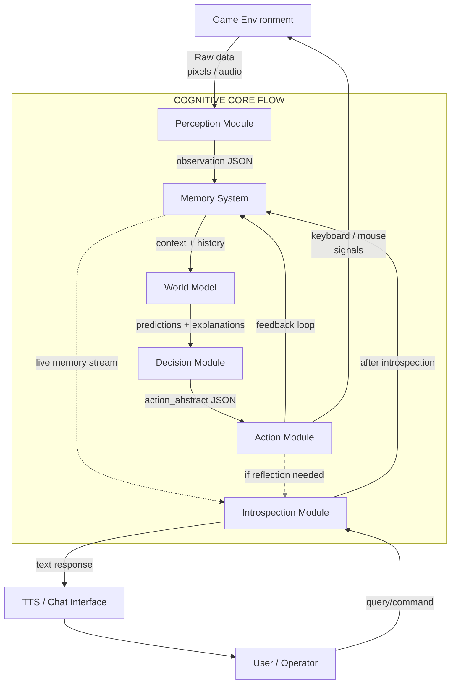

# Game-Agnostic Cognitive Player

> The project is frozen until possibly the summer of 2026.

   

## 🧠 About This Project

**Game-Agnostic Cognitive Player (GACP)** is an architecture for an autonomous LLM agent for video games, built using LangGraph. The agent learns to play from scratch, without prior knowledge of the rules, through observation, forming an internal world model, and experimentation. It demonstrates cognitive development transferable between different games and the capacity for introspective communication.

**Characteristics:**
- Does not know the game rules beforehand.
- Learns through observation, trial, and error.
- Forms its own hypotheses about the game world.
- Makes decisions and takes actions based on its internal model.
- Retains knowledge from past games and applies learned methods.

**Core Principles:**

1. Everything Through Perception. The AI receives:
- Data via screen recognition.
- A minimal action space (click, type, select).
- Use of direct game-specific APIs is prohibited.

2. No Prior Rule Knowledge. The AI:
- Does not know the win-condition,
- Does not know the interface,
- Does not know the terminology.
- It figures things out like a human.

3. Mistakes are Required.
- The AI should not immediately "play well".
- It must: Make mistakes. Rethink / Draw conclusions and solidify them.

4. Game-Agnostic
- Switching games ≠ rewriting logic in the cognitive core. Only changing the I/O adapter.


> **Personal Learning Lab**: This repository documents my journey of building a game-agnostic cognitive agent from the ground up. The main goal is understanding, not creating a ready-to-use system.

**Key Learning Goals:**
- Deep understanding of cognitive architectures
- Hands-on experience with LangGraph
- Exploring transfer learning in game AI
- Building complex LLM agent systems

**Note for Fellow Developers:** If you want to contribute, please focus on learning through code analysis and discussions rather than writing code for me.

## ✨ Features

**Key Architectural Principles:**
- Game-Agnostic Design - A single cognitive core for any game, without rewriting logic.
- Modular LangGraph Architecture - Clear separation of Perception, Memory, World Model, Decision, Action.
- Learning from Scratch - The agent doesn't know game rules beforehand; learns through observation and experimentation.

**Technical Innovations:**
- Unified Data Format (JSON) - Standardized observation/action/outcome structures between modules.
- Configurable Adapters - Connecting a new game = writing a config, not changing code.
- Measurable Cognitive Development - Metrics for hypothesis confirmation/refutation, adaptation speed.

## 🚀 Quick Start
**Prerequisites**
- Python 3.13+
- uv (recommended for Python package management)

### Installation & Run

**Clone and set up the project:**
```bash
git clone https://github.com/KotingGG/GameAgnosticCognitivePlayer.git
cd GameAgnosticCognitivePlayer
```

**Install dependencies:**
```bash
# Install uv if needed
curl -LsSf https://astral.sh/uv/install.sh | sh
uv sync
```

**Run the project:**
```bash
uv run src/gacp/main.py
```

## 🎮 How It Works
**GACP is a closed-loop cognitive architecture built with LangGraph.** It learns games from scratch like a human player, without prior knowledge of rules. The agent observes raw pixels, forms internal world models through experimentation, and transfers learned cognitive patterns between different games.

**Core Cognitive Loop:**
- Perception Module captures screen pixels and converts them into structured observation JSON with hypothesized objects and relationships.
- Memory System stores experiences in hierarchical memory (episodic buffer → vector DB → knowledge graph) for context and learning.
- World Model uses LLM reasoning to predict future states and generate explanations based on memory patterns.
- Decision Module creates action plans using shallow MCTS (depth=2-3) driven by internally-generated goals.
- Action Module translates abstract actions into keyboard/mouse signals via game-specific adapters.
- Introspection Module provides self-awareness and communication, analyzing memory streams and answering user queries.

**Key Mechanisms:**
- Game-Agnostic Core: Only Perception and Action modules contain game-specific adapters; cognitive core operates on abstract JSON formats.
- Unified Data Format: All modules exchange standardized observation, action, and outcome JSON structures.
- Learning Through Failure: Agent forms hypotheses, tests them, and updates its world model based on expectation violations.
- Transfer Learning: Knowledge acquired in NetHack (turn-based roguelike) accelerates adaptation to Factorio (real-time optimization).

## ⚙️ Конфигурация
TODO: ...

## 🛠️ Разработка

### Project Structure
```
GameAgmosticCognitivePlayer/
├── src/
│   ├── gacp/
│   │   ├── agent/                   # Agent Orchestration. Contains the LangGraph workflow definition (graph.py) and the central state schema (state.py) that wires the modules together.
│   │   ├── environments/            # Game Environments. Hooks and adapters for specific games (e.g., nethack.py, factorio.py).
│   │   ├── interfaces/              # External Interfaces. Code for TTS (Text-to-Speech), STT (Speech-to-Text), and other I/O channels.
│   │   ├── modules/
│   │   │   ├── action/              # Action Module (Game-Specific Adapter). Translates abstract actions into low-level keyboard/mouse signals.
│   │   │   ├── decision/            # Decision Module. Contains the Goal Manager and Planner for generating action plans.
│   │   │   ├── introspection/       # Introspection Module. Provides self-reflection and a dialogue interface for communicating with the agent.
│   │   │   ├── memory/              # Memory System. Manages the agent's short-term (episodic buffer) and long-term (vector/graph) memory.
│   │   │   ├── perception/          # Perception Module (Game-Specific Adapter). Transforms raw screen/audio data into structured observation JSON.
│   │   │   ├── world_model/         # World Model (LLM Core). The agent's reasoning engine for prediction and abductive inference.
│   │   │   ├── base_module.py       # Abstract Base Class. Defines the common interface that all cognitive modules (perception/, memory/, etc.) must implement.
│   │   └── main.py                  # Application Entry Point. The main script to initialize and run the GACP agent's workflow.
├── tests/                           # TODO.
├── configs/                         # Configuration Files. Stores YAML/JSON files for game settings, LLM prompts, and module parameters.
└── docs/                            # Project Documentation. Holds architectural diagrams (like your Mermaid charts) and other documentation.

```

### Project Architecture
The architecture is a closed-loop cognitive system for an autonomous game agent, implementing perception-thinking-action principles. It features a clear separation between the game-agnostic cognitive core and game-specific adapters, enabling portability across different game environments.

**Architecture Graph (detailed graph with breakdown of each step in every module -> [ARCHITECTURE.md](docs/ARCHITECTURE.md))



### Running Tests
TODO: ...

## 🗺️ Roadmap 2026-2027

## Year-Long Development Plan

### STAGE 0 (Months 0-2): Foundation Architecture
**Technical Goals:**
- Create architecture with stub test modules [2]
- Replace stub modules with full implementations [3]:
  - Perception Module (entry point) with two parts:
    1. General data capture layer
    2. Configurable interpreter (adapter)
  - Memory System (what it remembers)
  - World Model (how it explains the world)
  - Decision Module (why it acts)
  - Action Module (action execution)
  - Introspection Module (introspection)

**Implement unified data format [4]:**
- observation (Observation)
- action (Action)
- outcome (Outcome)

**Create a system where connecting a new game means writing configs for the interpreter and action mapping, NOT changing core code.**

**Crucial:** No game logic inside the cognitive core.

**Expected Outcome:**
Agent performs any action not randomly, but with textual explanation: "I'm doing X because I expect Y."

### STAGE 1 (Months 2-3.5): Learning Through Consequences (Cause → Effect)
**Technical Goals:**
- Implement short-term memory (last N steps)
- Implement action → outcome linking
- Introduce simple metric: "expectation confirmed / not confirmed"

**Expected Outcome:**
Agent changes behavior when its expectations are systematically broken.
It can say: "This approach no longer works."

### STAGE 2 (Months 3.5-5): Object and State Formation
**Technical Goals:**
- Add object representation (hypotheses, not classes)
- Add environment states (dangerous / safe / unknown)
- Separate:
  - "self"
  - "world"

**Expected Outcome:**
Agent avoids repeated mistakes.
Can formulate: "This object usually leads to bad outcomes."

### STAGE 3 (Months 5-6.5): Multi-step Planning
**Technical Goals:**
- Implement shallow planning (2-3 steps ahead)
- Action selection based on expected chain
- Limit planning by time/resources

**Expected Outcome:**
Agent sometimes chooses actions that are disadvantageous now but beneficial later.
Can explain: "I'm doing this so that later..."

### STAGE 4 (Months 6.5-8.5): Transfer Learning to Another Game
**Technical Goals:**
- Connect second game
- Implement adapter:
  - New observation processing
  - New action mapping
- **DO NOT** change the cognitive core

**Expected Outcome:**
Second game:
- First steps are chaotic
- But stabilization is faster than in the first game
- Measurable (number of steps to stability)

**Primary success metric:** Not only stabilization speed, but also the speed of creating a working config-adapter for a new game (e.g., 2 days instead of 2 weeks for the first game).

### STAGE 5 (Months 8.5-10.5): Self-generated Goals and Preferences
**Technical Goals:**
- Implement system of simple goals (not directly given)
- Implement "I like this / don't like this" evaluation
- Separate:
  - Survival
  - Exploration
  - Optimization

**Expected Outcome:**
Agent repeats chosen playstyle.
Its behavior is recognizable.

### STAGE 6 (Months 10.5-12): Reflection and Self-correction
**Technical Goals:**
- Implement periodic reflection ("what I understood")
- Implement revision of old hypotheses
- Store:
  - Successful strategies
  - Failed strategies

**Expected Outcome:**
Agent says: "I used to think X, but now I believe Y."
Behavior actually changes.

### Key Success Metrics Across All Stages:
1. **Architectural Purity:** No game logic in cognitive core
2. **Transfer Learning:** Demonstrable knowledge transfer between games
3. **Cognitive Development:** Observable progression in agent's reasoning
4. **Configurability:** New game setup time decreasing with each iteration
5. **Explainability:** Agent's ability to articulate its reasoning and learning

## 📄 License
This project is licensed under the MIT License - see the [LICENSE](LICENSE) file for details.
