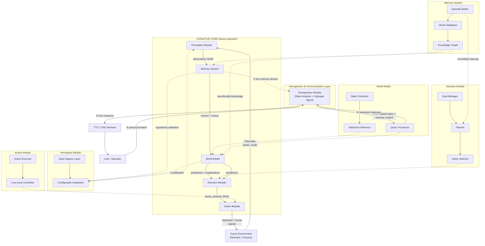

# Game-Agnostic Cognitive Player
[Main project document in Russian + roadmap](https://docs.google.com/document/d/1EvqQ1nDP_K-V4drSLzz3AxfX93gLw4JFqVFeqKXyCfk/edit?tab=t.0#heading=h.gjdgxs) (move everything from there to here)

[Русская версия](README.md) | [English Version](README_en.md)

  

**Game-Agnostic Cognitive Player (GACP)** – это архитектура автономного LLM-агента для видеоигр, построенная с использованием **LangGraph**. Агент учится играть с чистого листа, не зная правил, путём наблюдения, формирования внутренней модели мира и экспериментов, демонстрируя переносимое между разными играми когнитивное развитие и способность к интроспективному общению.

## ✨ Особенности
todo: заполни


## 🚀 Быстрый старт
**Предварительные требования**
- Python 3.13+
- uv (рекомендуется для управления Python-пакетами)

### Установка и запуск

**Клонируйте и настройте проект:**
```bash
git clone https://github.com/KotingGG/GameAgnosticCognitivePlayer.git
cd GameAgnosticCognitivePlayer
```

**Установите зависимости:**
```bash
# Установите uv, если нужно
curl -LsSf https://astral.sh/uv/install.sh | sh
uv sync
```

todo: заполни.

**Запустите проект:**
todo: заполни.

## 🎮 Как это работает
todo: заполни

## Архитектура AI-агента
todo: заполни



## ⚙️ Конфигурация
todo: заполни

## 📊 Метрики и оценка
todo: заполни

## 🛠️ Разработка

### Структура проекта
text
```
LieGraph/
├── src/
│   ├── gacp/
│   │   ├── cognitive_core/          # 
│   │   ├── environments/            # 
│   │   ├── interfaces/              # 
│   │   ├── modules/                 #
│   │   │   ├── action/              #
│   │   │   ├── decision/            #
│   │   │   ├── introspection/       #
│   │   │   ├── memory/              #
│   │   │   ├── perception/          #
│   │   │   ├── world_model/         #
│   │   │   ├── base_module.py       #
│   │   └── main.py                  # 
├── tests/                           # 
├── configs/
│   ├── games/                       #
│   └── prompts/                     #
└── docs/                            # 

```
### Архитектура системы
Подробная информация об архитектуре, дизайне компонентов и паттернах интеграции находится в [ARCHITECTURE.md](ARCHITECTURE.md).

### Запуск тестов
todo: заполни

## 📄 Лицензия
Этот проект лицензирован под лицензией MIT — подробности смотрите в файле [LICENSE](LICENSE).
