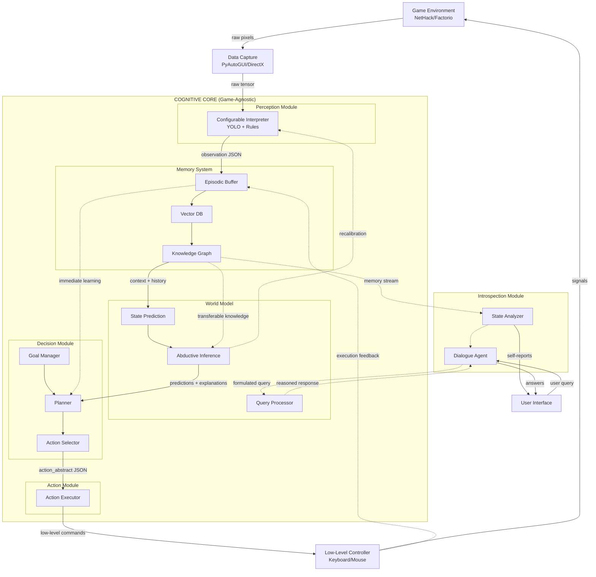

# Game-Agnostic Cognitive Player (GACP)
## Architecture Documentation

## Table of Contents

1. [Introduction](#introduction)
2. [Core Principles](#core-principles)
3. [Architecture Overview](#architecture-overview)
4. [Module Specifications](#module-specifications)
5. [Unified Data Format](#unified-data-format)
6. [Experimental Environments](#experimental-environments)

### Introduction

**Game-Agnostic Cognitive Player (GACP)** is an architecture for an autonomous LLM agent for video games, built using LangGraph. The agent learns to play from scratch, without prior knowledge of rules, through observation, forming an internal world model, and experimentation. It demonstrates cognitive development transferable between different games and the capacity for introspective communication.

**Characteristics:**
- Does not know game rules beforehand
- Learns through observation, trial and error
- Forms its own hypotheses about the game world
- Makes decisions and takes actions based on its internal model
- Retains knowledge from past games and applies learned methods

**What it is NOT required to be:**
- Stable in all conditions
- High-performance
- Universal for absolutely all games

**What it MUST accomplish:**
- Working architecture
- Proof of transfer learning
- Observable cognitive development
- Rapid adaptability to different games

**Project Principle:** The architecture must be correct; implementation - good enough.

**PROJECT GOAL:** Develop an LLM agent architecture capable of transfer learning between different environments, practically minimizing manual adaptation for each new game.

### Core Principles

1. **Everything Through Perception.** The AI receives:
   - Data via screen recognition
   - Minimal action space (click, type, select)
   - Use of direct game-specific APIs is prohibited

2. **No Prior Rule Knowledge.** The AI:
   - Does not know win-conditions
   - Does not know the interface
   - Does not know terminology
   - Figures things out like a human

3. **Mistakes are Required**
   - The AI should not immediately "play well"
   - It must: Make mistakes → Rethink → Draw conclusions → Solidify them

4. **Game-Agnostic**
   - Switching games ≠ rewriting logic
   - Maximum - different I/O adapter only

### Architecture Overview

The architecture is a closed-loop cognitive system for an autonomous game agent implementing perception-thinking-action principles. It features clear separation between game-agnostic cognitive core and game-specific adapters, enabling portability across different game environments.

**Architecture Graph:**


**Key Architectural Invariant:** Only Perception and Action modules contain game-specific adapters. The cognitive core (Memory, World Model, Decision) operates only on abstract representations in the unified format, which ensures the Game-Agnostic property.

### Module Specifications

The architecture is based on a cognitive architecture principle with a black-box approach.

#### I. Perception Module
**Purpose:** Transformation of raw environment data into structured semantic representation (observation) understandable by the cognitive core.

**Principle:** Separation into independent abstraction levels to ensure game-agnostic property.

**Level 1: Data Capture Layer**
- **Input:** Pixel buffer (screen), audio stream (optional), low-level system events
- **Output:** Raw but unified data (e.g., image tensor [H, W, C], timestamp)
- **Implementation:** System-dependent but standardized drivers (PyAutoGUI, DirectX capture). Contains no interpretation logic.

**Level 2: Configurable Interpreter (Adapter)**
- **Input:** Raw data from Level 1
- **Output:** observation in unified format - structured JSON describing hypothetical objects, their attributes, and relationships
- **Interpreter Core:** Set of change detection algorithms (frame differencing) and object detection. Initially uses pre-trained model (e.g., YOLO) with pseudo-learning approach
- **Pseudo-Learning Implementation:**
  - Hypothesis filtering
  - Confidence weighting
  - Rejection/confirmation of hypotheses via outcome
- **Adaptation:** "Config" consists of:
  - Anchors for repeating UI elements (determined through minutes of gameplay)
  - Semantic rules linking low-level features (color, shape, position, OCR text) to high-level hypotheses

#### II. Memory System
**Purpose:** Serialization, storage, and retrieval of experience for context formation and learning.

**Principle:** Hierarchical organization mimicking episodic and semantic memory.

**Episodic Buffer (Short-term Memory):**
- **Structure:** Circular buffer of last N tuples (observation, action, outcome, timestamp)
- **Purpose:** Providing context for current planning and immediate learning

**Vector Database of Episodes (Long-term Memory):**
- **Structure:** Indexed embeddings of key events and their outcomes
- **Purpose:** Similarity search for analogies and lesson extraction

**Relational Knowledge Graph (Semantic Memory):**
- **Structure:** Graph where nodes are established hypotheses about objects/classes, edges are established causal or spatial relationships
- **Purpose:** Storage of abstract, transferable knowledge about the world

#### III. World Model
**Purpose:** Formation and maintenance of an internal, explainable model of environment dynamics.

**Principle:** Data-driven black box, not a set of preset rules.

**Input:** Current observation, history from Memory, current state hypothesis
**Output:**
- **Prediction:** Multiple probable next environment states (observation') for given possible actions
- **Explanation:** Textual/logical justification of prediction based on patterns extracted from Memory

**Implementation:** LLM as reasoning engine. The LLM receives textual/structured context description and is tasked with prediction and abductive inference.

**Critical Implementation Note on MCTS:**
- **Very shallow implementation**
- **Hard constraints:**
  - Depth = 2 (max 3)
  - Branching = 2-3 actions
  - Simulations = 5-10, not 100+
- **LLM is NOT called at every node**
- **Instead:**
  - LLM called once per step
  - Generates transition hypotheses
  - Roughly evaluates consequences
  - MCTS simply enumerates these hypotheses without new LLM calls

#### IV. Decision Module
**Purpose:** Generation of action sequences to achieve internally generated goals.

**Principle:** Hierarchical planning based on World Model predictions and value assessment.

**Goal Manager:**
- Forms primitive goals based on internal drives (curiosity, survival) and patterns of successful outcomes extracted from Memory

**Planner:**
- Uses World Model for action space search (via shallow MCTS)
- Minimizes difference between predicted state and desired goal
- Limited by planning horizon for computational efficiency

**Action Selector:**
- **Input:** Selected plan from Planner
- **Output:** Abstract high-level action (action_abstract) in unified format

#### V. Action Module
**Purpose:** Translation of abstract decision into specific low-level commands executable in the environment.

**Principle:** Inverse of Perception Module. Has standardized input and game-specific output.

**Action Executor:**
- **Input:** action_abstract from Decision Module
- **Output:** Sequence of low-level signals (key presses, mouse movements, taps)
- **Implementation:** Contains mapping adapter configured for each new game

#### VI. Introspection Module
**Purpose:** Parallel module for self-observation, reflection, and external communication. It does not control the decision cycle but serves as a "mirror" or "inner voice" of the cognitive core.

**Principle:** Operates asynchronously and reactively through two channels:
1. **Subscription:** Passively observes data flow (primarily from Memory System), periodically generating textual summaries
2. **Query:** Actively processes external questions or commands, routing them to World Model and forming responses

**Components:**
- **State Analyzer:** Periodically analyzes Memory System content and generates textual conclusions
- **Dialogue Agent:** Processes external queries, reformulates them in context, and finds answers in Memory System
- **Learning Monitor:** Tracks learning metrics for reflection stages

**Interaction:**
1. **Input (subscription):** Receives update stream from Memory System (unidirectional)
2. **Input (query):** Accepts external commands from user interface
3. **Processing:** For complex queries, may form requests to World Model
4. **Output:** Generates text summary for TTS or text response to user

**Why it's OUTSIDE the main cycle?** Its task is commentary and communication, not control. Parallel operation ensures dialogue failures or delays don't freeze the main game loop.

### Unified Data Format

The format is an immutable data structure (tuple) circulating between modules and representing the only way they interact.

**Note:** Code structure may change. Below is an example representation, not exact implementation.

#### observation (Observation):
```json
{
  "timestamp": 1678901234567,
  "sensory_input": {
    "raw_frame_hash": "abc123...",
    "hypotheses": [
      {
        "id": "obj_1",
        "type_hypothesis": ["player", "controllable_entity"],
        "attributes": {
          "bbox": [100, 200, 50, 60],
          "color_dominant": "#FF0000",
          "text_associated": "Health: 100"
        },
        "relationships": ["near(obj_2)", "inside(region_1)"]
      }
    ],
    "ui_elements": [
      {"type": "text_block", "content": "Level 1", "bbox": [10, 10, 100, 30]}
    ]
  },
  "self_state": {
    "last_action_id": "act_prev",
    "internal_drives": {"curiosity": 0.8, "energy": 0.5}
  }
}
```

#### action (Action):
```json
{
  "id": "act_1",
  "abstract_command": {
    "verb": "NAVIGATE_TO",
    "target": "obj_2",
    "manner": "CAUTIOUS"
  },
  "generated_by_plan": "plan_alpha",
  "expected_outcome": "hypothesized_door_1 becomes reachable"
}
```

#### outcome (Outcome):
```json
{
  "observation_next": {...},
  "expectation_met": true,
  "reward_signal": 0.05,
  "lessons_learned": ["obj_2 is immovable"]
}
```

### Experimental Environments

To validate the architecture's stated properties (game-agnostic, transfer learning, internal world model formation), two fundamentally different game environments are used as experimental testbeds.

#### First Game - Training Environment
**Name:** NetHack (ASCII/tileset mode)
**Role:** First environment for forming basic cognitive mechanisms
**Reasons for Choice:**
- 2D turn-based environment without timing constraints
- Partially hidden world
- High density of cause-effect relationships
- Minimal requirements for Perception Module in early stages

#### Second Game - Transfer Environment
**Name:** Factorio (2D)
**Role:** Second environment for testing transfer learning without changing cognitive core
**Reasons for Choice:**
- Radically different task type (optimization, production, long-term planning)
- No explicit win-conditions
- Complex interface and rich interaction system
**Success Criterion:**
- Reduced adaptation time compared to first environment
- Reduced number of chaotic actions
- Formation of structured behavior in early game stages

**General Statement:** The choice of specific games is not part of the architecture and can be changed without affecting the cognitive core. Games are used exclusively as tools for experimental validation of stated properties.